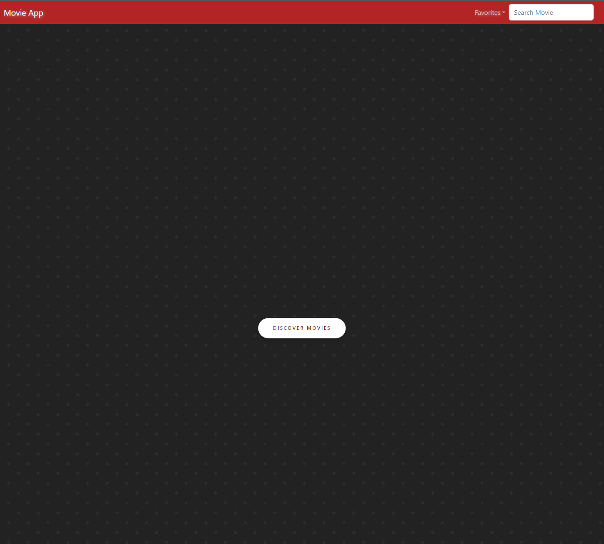
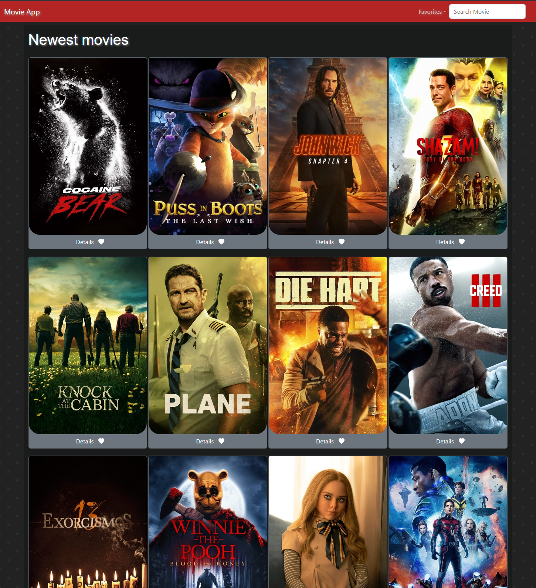
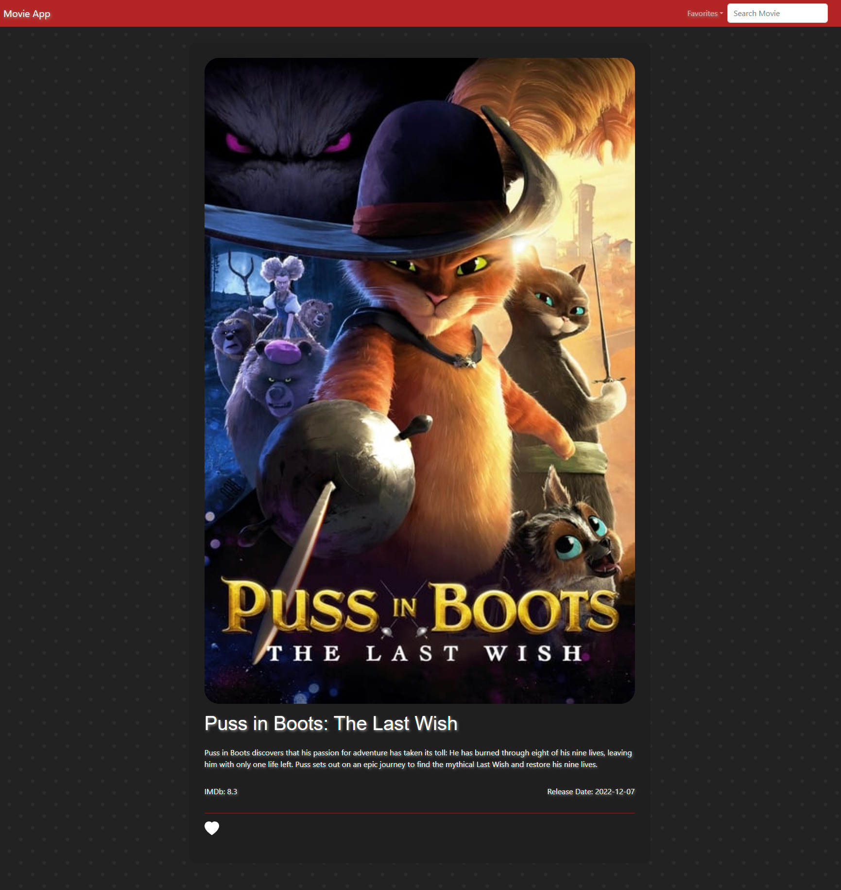

# Movie React App

Movie App project was bootstrapped with [Create React App](https://github.com/facebook/create-react-app).

Home:

Discovery:

Movie detail:

## Built with

- React
- CSS

## Using

### Done

- publicly available [TMDB API](https://www.themoviedb.org/documentation/api) to search movies
- css and react-bootstrap design, components and props
- state and events
- `useState`, `useEfect` hooks
- form and dropdown elements
- lifting the state up
- rendering lists of data
- `map` and `filter` methods
- conditional return statements
- horizontal scrolling
- routing with [React-Router](https://reactrouter.com/en/main) `Link` and `useNavigate`
- `localStorage` with get and set to favorite movies

### To do

- unfavorite movies
- state showing favorited movies (from Discovery page and MovieDetails page)

## Getting started

1. Clone/Download the repo.

2. To install node_modules run:

### `npm i`

3. Run the app in the local development mode.\
   Open [http://localhost:3000](http://localhost:3000) to view it in your browser.

### `npm start`

4. Make required changes to suit your needs.

## Dockerized

[docker-hub](https://hub.docker.com/u/dzoliana)

## Footnote

The API keys from the config.js file are hidden in gitignore.
